# IACA UAV Coverage: A Reproducibility Study

Reproducibility study and extension of:
> Yedilkhan et al., "Efficient Area Coverage Strategies for High-Altitude UAVs in Smart City Monitoring", *Drones* 2025, 9, 632.

We re-implemented the Inverse Ant Colony Algorithm (IACA) with Artificial Potential Field (APF)
motion control in Webots, reproduced the paper's results, and extended the algorithm with
several improvements described below.

---

## Authors
- **Travis Brown**
- **Andrew Isaacson**
- **Caleb Talbott**

---

## Requirements

- [Webots R2023b or later](https://cyberbotics.com/)
- Python 3.10+
- Python packages: `numpy`, `scipy`, `matplotlib`

Webots executes the global Python installation when running simulations. To set the specific Python installation used by Webots:

1. Open **Webots**.
2. Go to **Tools > Preferences** *(Windows & Linux)* or **Webots > Preferences** *(macOS)*.
3. In the **General** tab, find the **Python command** field.
4. Paste the absolute path of the Python executable you wish to use.

Install the following pacakages:

```bash
pip install numpy scipy matplotlib
```

If you defined a different installation in Webots, install the packages using the following command:
```bash
C:\path\to\installation\python.exe -m pip install numpy
```

---

## Project Structure

```
iaca-uav-coverage/
├── worlds/
│   ├── iaca_osm_world.wbt            # Webots world file (Astana, Kazakhstan OSM map)
│   └── iaca_osm_world.wbproj         # Webots project file
├── controllers/
│   ├── config/
│   │   ├── configs.json              # Defines the settings for running this algorithm. 
│   │   ├── full_config_example.json  # Example parameter configuration for experimenting.
│   ├── shared/
│   │   ├── sharec_c.py               # Global parameters (grid size, world bounds, drone count, etc.)
│   │   └── equations.py              # All equations from the paper, implemented and documented
│   │   └── tmp/                      # Stores temporary RNG state between supervisor and drone
│   ├── iaca_supervisor/
│   │   ├── iaca_supervisor.py        # Central supervisor: pheromone map, priority map, drone coordination
│   │   └── supervisor_c.py           # Supervisor-specific parameters (P_MAX, alpha, lambda, etc.)
│   │   └── out/                      # Outputs coverage and compressed NumPy results for configuration simulations.
│   └── iaca_drone/
│       ├── iaca_drone.py             # Per-drone controller: APF force, PID stabilization, wind
│       ├── pid_controller.py         # Crazyflie PID controller (provided with drone model)
│       └── drone_c.py                # Drone-specific parameters (speed, boundary strength, etc.)
├── scripts/
│   ├── plot_iaca_results.py          # Plot coverage over time, drone paths, pheromone/priority maps
│   └── animate_pheromones.py         # Animate pheromone and priority maps as GIFs or live
├── pics/
│   └── **/*.png                      # Images generated from simulations, used in README.md and VERSIONS.md
└── README.md
```

---

## Configuration

All algorithm parameters are initialized with default values that can be found in: (`shared/shared_c.py`, `iaca_supervisor/supervisor_c.py`, `drone/drone_c.py`) inside of the `controllers/` directory. Create custom parameter configurations to start running simulations with custom parameters in `controllers/config/configs.json`.

### Configuration Setting JSON Structure

```json
{
    "experimenting": bool,
    "temp_dir": str,
    "output_dir": str,
    "rng_state_file": str,
    "iaca_run": str,
    "final_coverage": str,
    "seed": int,
    "num_sims": int,
    "configs": [{...}, ...]
}
```

| Field | Description |
|-------|-------------|
| `experimenting` | If set to `true`, the supervisor will run simulations on the algorithm using the default parameter values; otherwise, the simulations will be executed across each configuration in `configs`. Default: `false`
| `temp_dir` | Name of the `tmp/` directory where temporary data files are stored for serialized supervisor to drone communication. Contained within the `shared/` directory. Used for transmitting a NumPy RNG Generator instance. Standard: `"tmp"` (recommended to not change) |
| `output_dir` | Name of the `out/` directory where final coverage and compressed IACA results are stored. Contained within the `iaca_supervisor/` directory. Standard: `"tmp"` (recommended to not change)
| `rng_state_file` | Name of the serialized NumPy RNG Generator file for state transfer between the supervisor and drones. Standard: `rng_state.pk1` (**should not be changed**) |
| `final_coverage` | Name of the JSON file which stores the average final coverage results across all simulations and parameter configurations. Default: `"final_coverages.json"` |
| `seed` | Seed used across all simulations. Used to produce repeatable stochastic results across simulations. Default: `2000` |
| `num_sims` | Number of simulations to run for each parameter configuration. Default: `1` | 
| `configs` | Array of `0..N` JSON objects which contain the `"name"` of the configuration, and the `"shared"`, `"drone"`, and `"supervisor"` parameter values. Each field should match exactly with the defined attributes in the constant classes: `SharedConstants`, `DroneConstants`, `SupervisorConstants`; contained within subdirectories found in `controllers/`. Additionally, the value types should correspond to the same types in the class attribute definitions. |

### Single Config Object (in `configs`):

A config object must include the `"shared"`, `"drone"`, and `"supervisor"` fields with an associated object `{}`. The object can be blank indicating to use all default parameters. Parameter definitions can also be emitted from the object to receive a default assignment.

```json
{
    "name": str,
    "shared": {
        "tick_rate_ms": int,
        "max_steps": int,
        "world_x_min": -float,
        "world_x_max": float,
        "world_y_min": -float,
        "world_y_max": float,
        "grid_rows": int,
        "grid_cols": int,
        "number_of_drones": int,
        "sensor_radius_meters": int,
        "height_desired": float
    },
    "drone": {
        "boundary_strength": float,
        "boundary_margin": float,
        "delta_v_max": float,
        "alpha_velocity": float,
        "max_world_speed": float,
        "wind_update_period": float,
        "wind_std": float,
        "wind_max": float,
        "exclusion_strength": float,
        "exclusion_margin": float
    },
    "supervisor": {
        "p_max": float,
        "alpha_pheromone": float,
        "noise_fraction": float,
        "lam": float,
        "priority_exponent": float,
        "startup_hover_time": float,
        "save_maps_interval": int,
        "print_interval": int,
        "supervisor_step_size": int,
        "spawn_radius": float,
        "use_exclusion": bool,
        "exclusion_margin_cells": int
    }
}
```

**Start with `shared`** for the
most impactful settings:

| Parameter                     | Config | Description                                                                                                          |
|-------------------------------|---|----------------------------------------------------------------------------------------------------------------------|
| `number_of_drones`            | `shared` | Number of drones to spawn                                                                                            |
| `max_steps`                   | `shared` | Simulation steps (100k = ~53 min simulated time)                                                                     |
| `grid_rows & grid_cols`       | `shared` | Grid resolution (paper used 500×500)                                                                                 |
| `world_x/y_min/max`           | `shared` | Coverage area bounds in meters (paper used ±450m)                                                                    |
| `sensor_radius_meters`        | `shared` | Drone sensor coverage radius (we used 10m)                                                                           |
| `seed`                        | `shared` | RNG seed for reproducibility                                                                                        |
| `use_exclusion`               | `shared` | Enable exclusion zones for non-rectangular areas |
| `tick_rate_ms` | `shared` | Webots simulation step (paper used 32ms) |
| `height_desired` | `shared` | Target altitude in meters for drones, which is passed to PID controller. |
| `p_max`                       | `supervisor` | Maximum pheromone value                                                                                              |
| `alpha_pheromone`             | `supervisor` | Pheromone exponential decay factor                                                                                   |
| `noise_fraction` | `supervisor` | Random perbutation factor added to pheromone map each supervisor update (paper set this to ±0.5) |
| `lam`                      | `supervisor` | Spatial pheromone decay factor (lambda)                                                                                      |
| `priority_exponent` | `supervisor` | Controls sharpness of priority contrast between high and low pheromone cells (gamma) (paper set this to 4.0, we set it to 1.0) |
| `exclusion_margin_cells` | `supervisor` | Controls how far from exclusion boundary repulses |
| `supervisor_step_size` | `supervisor` | Number of steps map updates occur (we set to 15) |
| `startup_hover_time` | `supervisor` | Number of elapsed seconds before drones start moving |
| `save_maps / print_interval` | `supervisor` | How often data snapshots are taken during a simulation |
| `spawn_radius` | `supervisor` | Radius in meters at which drones are placed in a circle |
| `max_world_speed`             | `drone` | Max drone speed in m/s                                                                                               |
| `delta_v_max` | `drone` | Maximum velocity increment applied per step |
| `d_max` | `drone` | Maximum diagnonal velocity for drone. Default: sqrt(shared.cell_size_x ** 2 + shared.cell_size_y ** 2) |
| `alpha_velocity` | `drone` | Velocity smoothing factor |
| `boundary_strength`           | `drone` | Strength of boundary deterrent force                                                                                 |
| `boundary_margin`             | `drone` | width of area where boundary deterrent force will be applied                                                         |
| `exclusion_margin / strength` | `drone` | Same as boundary variables but for exclusion zones; generally should be larger due to differences in implementations |
| `wind_std/max` | `drone` | Gaussian parameters for sampling a wind vector for simulating wind disturbances. |
| `wind_update_period` | `drone` | Seconds between simulated wind disturbances |


> **Note on step count:** Each Webots timestep is 32ms. 15,000 steps ≈ 8 minutes of simulated
> flight; 100,000 steps ≈ 53 minutes.

---

## Running a Simulation

1. Open `worlds/iaca_osm_world.wbt` in Webots.
2. Create and adjust parameters in `configs.json` as desired.
  1. Setting `"experimenting"` to `true` will run the default configuration. Otherwise, all configurations in `"configs"` will be ran sequentially.
  2. Each configuration will be ran `"num_sims"` times, where the average coverage across simulations is records.
3. Press **Play** in Webots. The supervisor will automatically spawn the configured number of drones.
4. The simulation will pause automatically when `max_steps` from `"shared"` is reached.
5. Results are saved to `controllers/iaca_supervisor/out/iaca_run_output.npz` and `controllers/iaca_supervisor/out/final_coverages.json`.

---

## Visualizing Results

All scripts should be run from the `scripts/` directory, or with the output `.npz` file in the
same directory.

**Plot coverage over time, drone paths, and final pheromone/priority maps for config:**
```bash
python plot_iaca_results.py --config config_name
```

**Animate pheromone and priority maps over time for config (saves as GIF if `save=True`):**
```bash
python animate_pheromones.py --config config_name
```

To save GIFs, set `save = True` inside `animate_pheromones.py` and update the output paths.

---

## Results


### Results with Paper's Parameters

The following results are from a full-scale run using the hyper parameters given by the paper: 2 drones, 900×900m area, 500×500 grid,
100,000 steps (~53 minutes simulated flight time), 10m sensor radius (not given in paper, so empirically determined from sensor radius in research).

**Coverage over time**: reaches ~16% by end of run. Note that the paper never reports a
coverage percentage despite this being the primary metric for an area coverage algorithm.

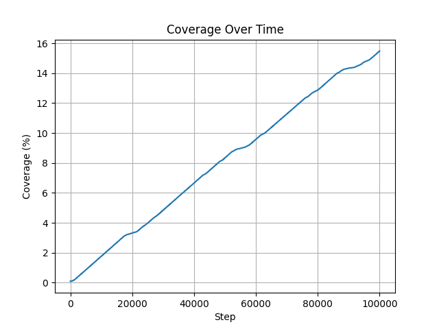

**Drone paths**: the 2 drones fly with little amounts of overlap, although with only two of them, at the speed they go, they 
do not have very much opportunity to do very much. Even though we are using the hyperparameters given in the paper, including the number of timesteps to let them go for,
they do not go nearly as far as we see them go in the papers figures, which is likely a result of them altering parameters in their implementation without disclosing those changes in the paper.

The drones do stray quite far off the edge of the target area, almost 200m in some cases, which is a major issue with the paper's implementation and a problem we have fixed in our own implementation.

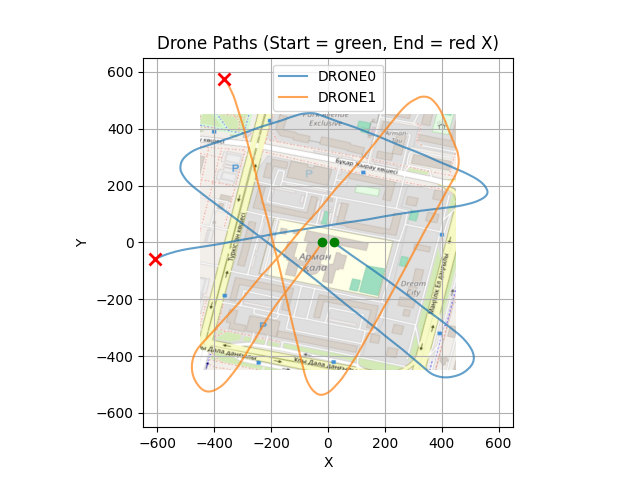

**Final pheromone map**: only the drones' immediate positions show high pheromone intensity. This is hard to see as both are off the edge of the map, but there is a lack of persistent trail of where they have been, 
which is a major issue with the papers hyperparameters. The pheromone decay is too high and the spatial decay is too aggressive, causing the pheromone to dissipate almost immediately after being deposited.

The near-zero trail left behind is a key issue: without a persistent pheromone trail, drones have little memory of where they've been, which limits coverage efficiency.

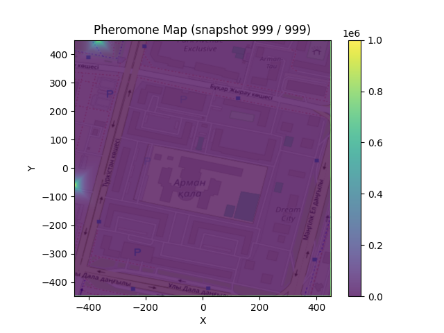

**Final priority map**: clear directional gradient pointing toward the least-visited areas,
showing the algorithm is correctly steering drones toward currently un-covered regions. However, the lack of a strong pheromone 
trail means this gradient is almost entirely based on current drone locations rather than a longer-term memory of coverage.

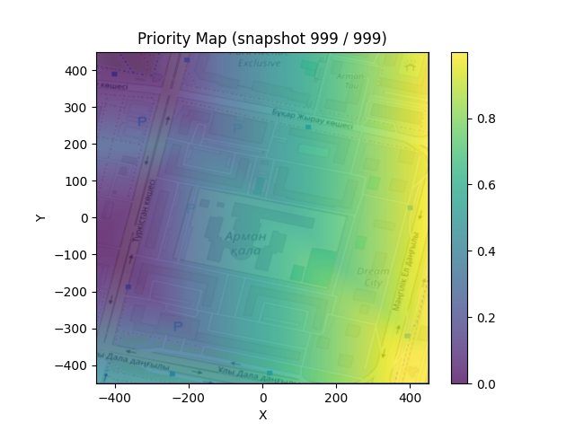


### Results with our own Parameters

These results are from a full-scale run using hyper parameters determined by our own expirimentation: 2 drones, 900×900m area, 500×500 grid,
100,000 steps (~53 minutes simulated flight time), 10m sensor radius.

Alpha, lambda, delta max velocity, and max velocity were the core parameters changed to allow us an increased coverage and pheromone memory.

**Coverage over time**: reaches ~24% by end of the run.

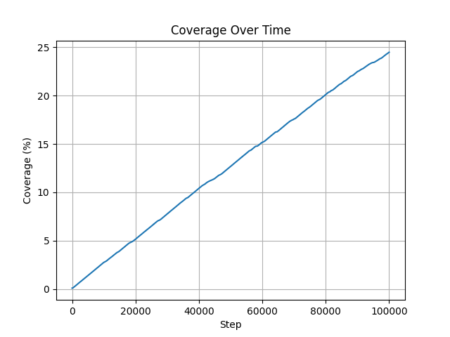

**Drone paths**: the 2 drones fly with some amounts of overlap, which is seen in the paper results as well. Note the lines that 
run closely in parallel are far enough that there is no overlap in coverage due to the 10m sensor radius. 

The drones do not stray far outside the target area, which is due to an alteration in our implementation involving
changes made in how the drones interact when approaching and past the area border, which is a massive improvement over the papers implementation.

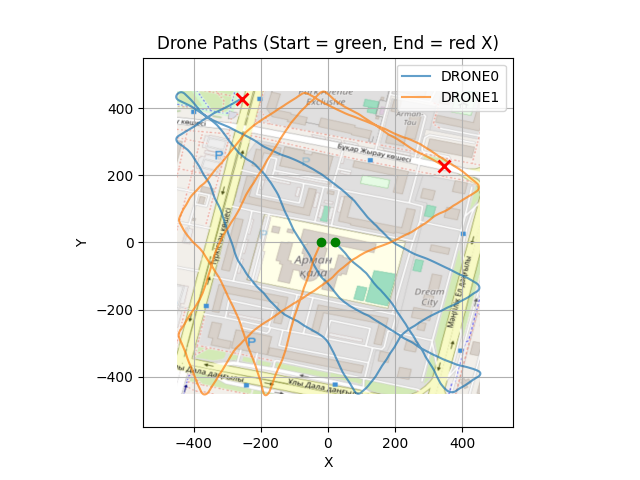

**Final pheromone map**: Our parameters allow for a much stronger and more persistent pheromone trail. This creates a much clearer memory of where drones have been, which helps steer them toward un-covered areas and improves overall coverage efficiency. The trail is still strongest near the drones' current positions, but it extends much farther back along their paths compared to the paper's parameters.

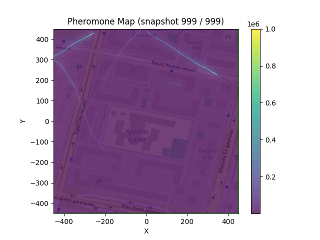

**Final priority map**: Our priority map still shows a clear directional gradient towards the least-visited areas, but with our parameters, this gradient is influenced by a stronger pheromone trail, giving drones better guidance based on both current positions and historical positions.

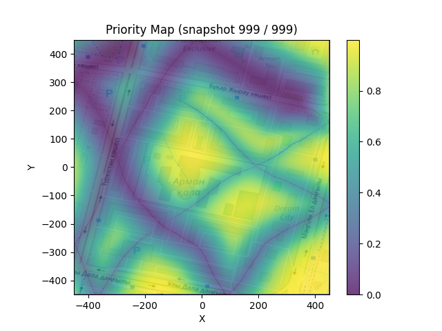


### Animated GIFs of pheromone and priority maps from our Parameters

**Pheromone map animation**:


**Priority map animation**:


---

## Exclusion Zones (Non-Rectangular Areas)

A large issue found with the paper is that the algorithm only supported rectangular coverage areas. This is a major limitation 
for real-world applications, where the area of interest may have an irregular shape or contain obstacles.

To restrict coverage to a non-rectangular area, set `USE_EXCLUSION = True` in
`shared_constants.py`, then define your exclusion bitmap in the `make_exclusion_mask()`
function in `supervisor_constants.py`. Any cell where the mask is `True` is treated as
out-of-bounds: drones will avoid it and it will not count toward coverage percentage.

Example (diamond-shaped coverage area):
```python
def make_exclusion_mask():
    # ... coordinate setup ...
    mask = np.abs(XX) + np.abs(YY) > 500
    return mask
```

The excluded area (red) is avoided effectively, with drones staying well within the
diamond-shaped coverage region:

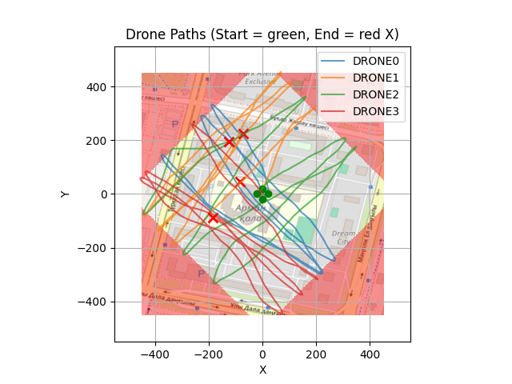

The pheromone and priority maps show how excluded cells are handled; excluded areas are
locked to maximum pheromone and zero priority, plus a repulsive boundary force pushes
drones back toward the valid area:

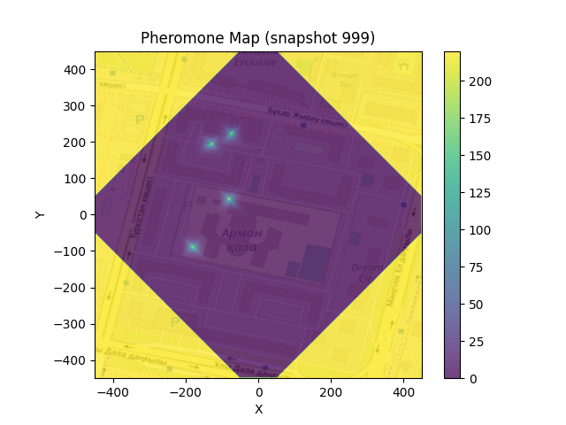

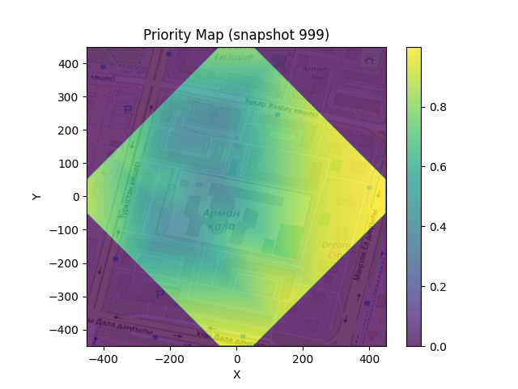

Exclusion zones also work for interior areas, such as a no-fly zone in the center of the
map. Drones depart from the center at startup but leave immediately and do not return:

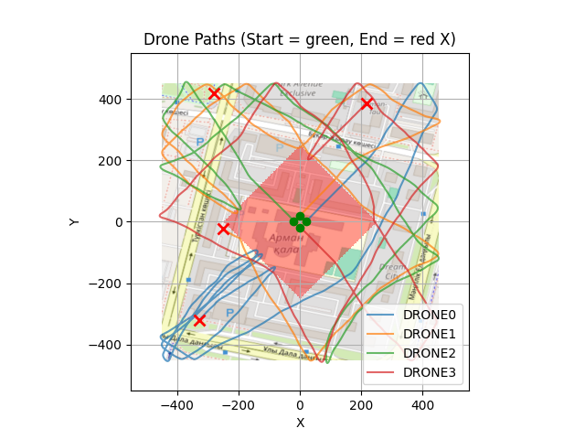

The plot below extends past the edge of the target area, confirming that our boundary
deterrent keeps drones very close to the coverage region: a significant improvement
over the original paper's implementation, where drones would consistently fly over 200m out of bounds before turning around:

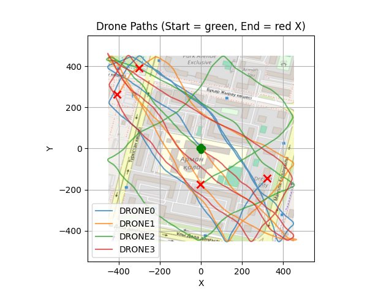

---

## Deviations from the Paper

During reproduction we identified several ambiguities and inconsistencies in the original
paper that required our own judgment calls:

- **Pheromone max value:** The paper states `P_MAX = 220`, but their own pheromone map
  figures show values exceeding 1,000,000. We use `P_MAX = 1,000,000` to match the figures.
- **Coverage sensor:** The paper does not specify a sensor type or coverage radius. We use
  a 10m circular footprint, which we consider realistic for a downward-facing camera at
  low altitude.
- **No coverage percentage reported:** The paper never states what percentage of the area
  was actually covered in any of its runs, despite this being the primary metric for an area coverage algorithm.
- **Webots architecture:** The paper does not describe how logic was split between the
  supervisor and drone controllers. We made our own architectural decisions based on the
  paper's prose descriptions.
- **PID controller:** Not described in the paper. We use the Crazyflie's default PID library
  with additional velocity smoothing to prevent instability during sharp direction changes.
- **Missing hyperparameters:** Several values were not given; others appeared to have been
  changed between the text and figures without disclosure. We tuned `alpha`, `lambda`,
  step size, and drone speed empirically.

---

## Our Extensions

Beyond reproducing the paper, we added the following:

- **Boundary deterrent force** - keeps drones tighter to the target area rather than
  wandering significantly out of bounds before turning around (see `boundary_force()` in
  `iaca_drone.py`)
- **Exclusion zone support** - designate arbitrary areas as off-limits via a boolean bitmap,
  enabling non-rectangular coverage areas (see `make_exclusion_mask()` in
  `supervisor_constants.py`)
- **Dynamic drone spawning** - drone count and spawn positions configured automatically
  from `shared_constants.py` without editing the world file
- **Adaptive neighbor lookup** - scales the number of grid cells examined based on the
  search area size, improving performance on larger maps
- **Corrected pheromone update** - fixed implementation to exactly match the paper's
  equations (Chebyshev distance decay, exponential smoothing)
- **GIF animation output** - visualize how the pheromone and priority maps evolve over
  the course of a full run (see `animate_pheromones.py`)
- **Coverage percentage tracking** - explicitly track and log what percentage of the target
  area has been observed, a metric absent from the original paper


## Further Improvements

- Automated simulation testing via Webots CLI
  - Managed to set this up to run on the software with UI.
- Further hyperparameter optimization.
- Potentially ROS 2 integration for parallel simulations or world batching.
- Testing on larger and more complex environments.
- Comparing against other coverage algorithms (e.g. lawnmower, random walk) for baseline performance.
