# IACA UAV Coverage Updates

---

## Table of Contents

- [Current WEBOT setup](#current-webot-setup)
- [v3.2 - Radius Adjustments & Large Scale Testing](#v32)
- [v3.1 - Boundary Deterrents & Performance Optimization](#v31)
- [v2 - Stability Constraints & Grid Scaling](#v2)
- [v1 - Initial Implementation & Environment Setup](#v1)

---

## Current WEBOT setup

*For reference, each step is 32ms, so 15k steps is 8 minutes of simulated flight; 100k steps is 53 minutes of simulated flight.

## v4.2
Travis - 04/30/2026

#### Main thing: Added support for non-rectangular areas, or otherwise areas to be avoided

#### Also updated the plotting script to show past edge of map to see how far the drones are going out of bounds. This can be seen below all the exclusion stuff V

So I added support to take an exclusion bitmap as input, which is just a 2d area of the same size as the grid, where `1`'s represent that drones should avoid this area.
By adding this to the supervisor, the drones will now avoid flying over these areas, and they will also not be considered when calculating coverage, as the drones aren't expected to go there.
For all intents and purposes, these areas are treated the same as going out of bounds, so the drones will turn around and try to go back towards the closest "in-bounds" position they know of, which is the same as how they react to going off the edge of the designated coverage area.

My main motivation for this was that not all areas that we want to cover are going to be a perfect rectangular shape, so 
doing this allows up to avoid having the drones waste time flying over areas that we don't care about, and also allows us to test the algorithm's ability to handle more complex shaped areas.

I added a few more weights to support this, and also added visuals for exclusion areas should they exist. Here is an example of 
a test run with the exclusion area being used to form the map into a diamond shape (created with `exclusion_bitmap = abs(x) + abs(y) > 500`).

As seen below, it does an extremely good job of staying out of the red exclusion area.

As seen from the pheromone and priority maps, this exclusion zone is mainly done by having the area marked as excluded (from the input bitmap)
always being set to max pheromone and minimum priority, along with a border force similar to the one used for the edge of map, which pushes the drones away from the area and back towards in-operations area.

And here is an example of the middle being excluded. It does a great job of staying out of the middle (except at startup obviously because they start in the middle, but even then they head straight out without lingering).

Okay, so for the plotting with past edge of map, here is an example at the full size, where you can clearly see that the drones 
are barely (if at all) going out of bounds before turning around, which was a massive problem in the original paper.

## v4
Travis - 04/23/2026

### Things we've added since v3.2:
- Added the stochastic simulated wind mentioned in the paper
- Textures for buildings are back!
- Updated how data-logging is occurring to match paper
- Improved plotting script, and created a script to show animation of coverage / pheromone map. 
- Added a dynamic creation of drone numbers & spawn points, for easier testing 
- Caleb fixed our pheromone update function to actually match what the paper does.

### Results
Ok, we are able to run the full 700m by 700m area with 500x500 grid size, 4 drones, 1.5m/s max speed, 100k steps, and 10m coverage radius, 
with the simulated wind, and we get about ~5.5x speedup, and about 55% coverage... Probably need to optimize the hyper-params to 
get that higher. 

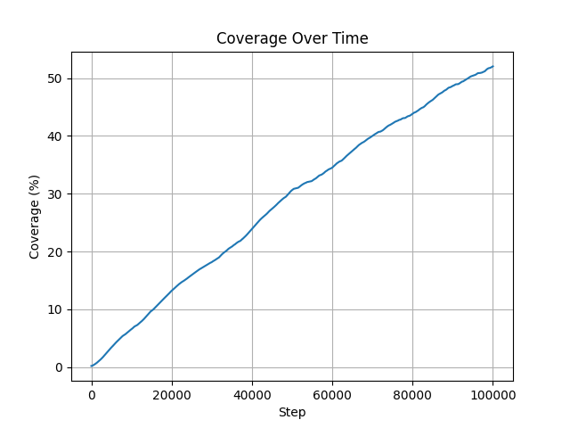

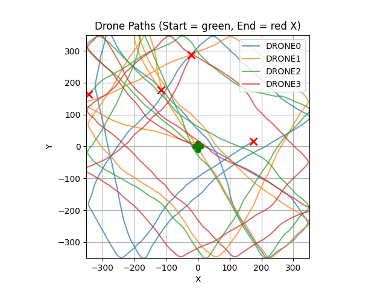

End of pheromone & priority map results below. 
The pheromone map looks pretty close to what the paper looks like, which is expected. But also, you can see that there is effectively
no pheromones left behind the drones, meaning there is no "trail" for the drones to avoid and therefore explore new areas...

The priority map also looks vaguely similar to the papers, although they clearly did smoothing of their heatmaps snapshots, 
as the paper's looks extremely smoothed, which is kinda a crazy thing to do, as it literally is altering the results 
they show in the paper.

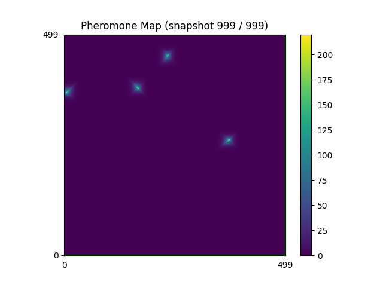
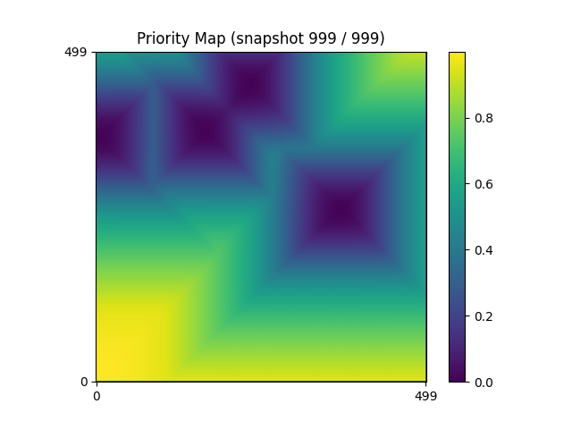

Here are the gifs of the pheromone and priority maps over time. 

I think the priority gif is a really good one because it shows the clear directional gradient towards the area that the drones haven't been in recently / no drones are nearby to.

## v3.2
Travis - 04/16/2026

*All tests so far have been done with 4 drones

Ok so I was thinking about it and decided that a coverage radius of 30m is probably unrealistic, as to be able to see 30m in
each direction the onboard cameras probably can't see anything in enough detail for it to be useful. Thus, I have shrunk the radius
down to 10m, which I think is more appropriate.

Also, I just realized that nowhere I can see in the paper do they discuss the area coverage they got in their results (like percentage of total area covered),
which I feel is like... the **main** way to see performance of an *area coverage algorithm*... Anyways, back to my changes / improvements...

I think the over-zealous pick of 30m coverage radius in v3.1 was why we were able to get 99% coverage, especially with seemingly 
non-optimal flight paths. Here, we still get ~70%, which also might be an overstatement due to coverage radius still being too high,
but I think much better overall. Results for same test but 10m radius is below.

Also, remember that the paper did 100k timesteps, and I'm only doing 15k for sake of time, so any results I get would be a
fraction of the full runs. I plan to do the 100k timesteps once I am running the full area/grid size.

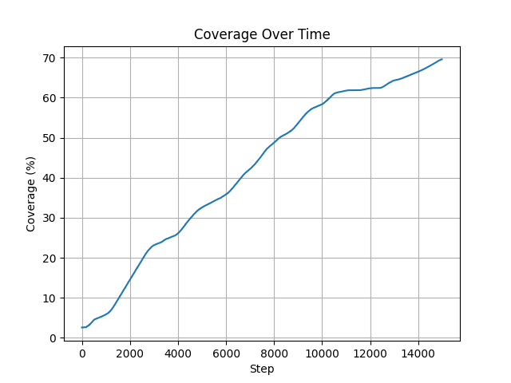

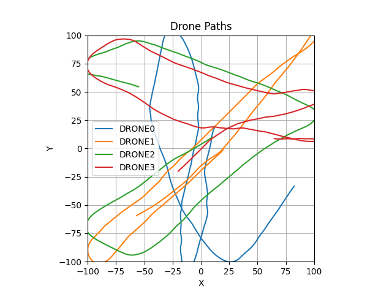

And just for shits and giggles below is a 400m by 400m area, 300x300 grid size, 50k max steps (26:40min simulated time), still with 10m coverage radius
and 4 drones. Max speedup was ~6.25x. Overall coverage at end was ~65% which honestly isn't terrible maybe? idk...

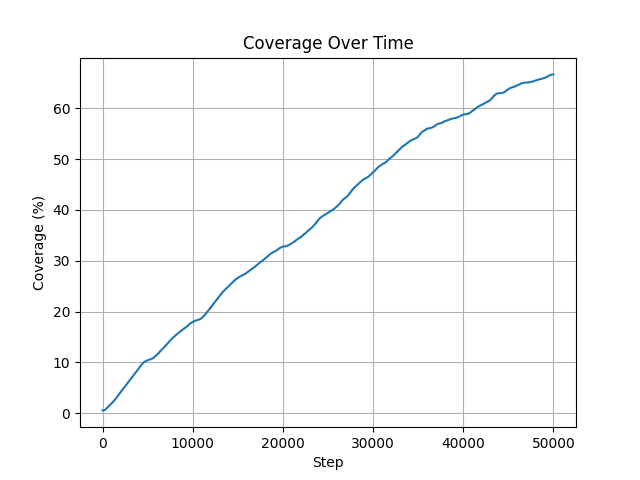

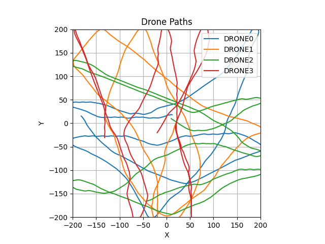

Okay and here is the current algorithm running a 700m by 700m area, grid size 500x500, 100k steps (53 min simulated time), 
took about 20 min to run, max speedup was ~3.5x. Final coverage was ~55%, and honestly the pathing looks wild, no visible 
structure just drones going everywhere.

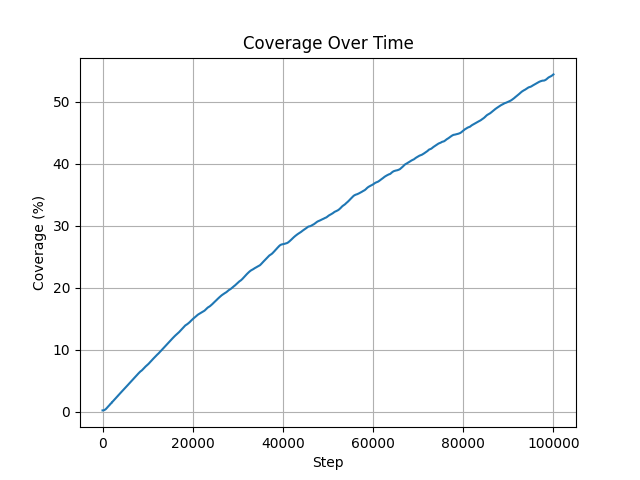

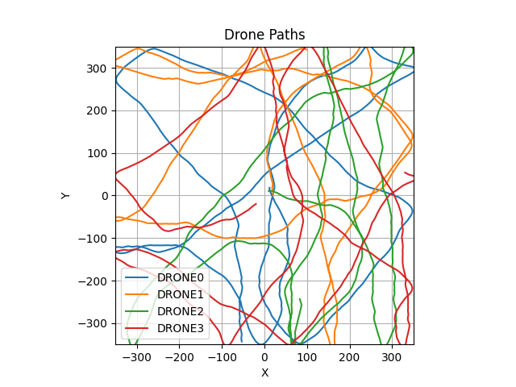

---

## v3.1
Travis - 04/16/2026

Including the changes that Caleb did for v2, I created seperate python files to hold constants to more easily test changes.

Notice some missing things that the paper did that I didn't, that significantly increased performance (I forgot to add a supervisor step size).

I also added a boundary deterrent, so that if a drone is headed towards the edge of the map, seen in `iaca_drone.py` as the `boundary_force(...)` function. 
All this does is alter the direction of the drone slightly leaning it back towards the center of the area whenever it is near or outside the edge of the area. This 
helps the drone to turn around faster, as changing direction is one of the drones struggles. 

Before I go any further, note that v2 results are no longer comparable, as I changed the radius of what is considered "covered" when passed by a drone.
So dont try to compare coverage between the two too hard.

The paper did not give what their radius of coverage is, nor what sort of sensor was being used to decide coverage, so I
assumed that using a video camera from a relatively average altitude you could capture a decent area around yourself.

Now I am able to run on much larger areas in a reasonable amount of time. I did a 200m by 200m area with grid size of 200x200, 
using 15,000 steps, and a sensor radius of 30m (i think thats reasonable?), and it was able to do a beautiful 99% coverage. 
I redid it with another seed and it did nearly the same (96%). Not sure if this is just because 15k  steps is overkill for an area of this size, but 
I've attached the graphs below. As you can see, while the paths aren't pretty, the drones do a wonderful job of staying 
in the area, either curving to avoid going out of bounds, or clearly turning around just off map. I see this as about as good as you get for
staying in the area, but the pathing might leave a little to be desired.

Although I will say being able to coverage the 200m by 200m area in 8 minutes is pretty good I think.

Also to note, my max speedup is ~8x now. The biggest contributor is obviously the `SUPERVISOR_STEP_SIZE`, and the higher the better,
but I think 15 is a good spot for it, and the paper has similar.

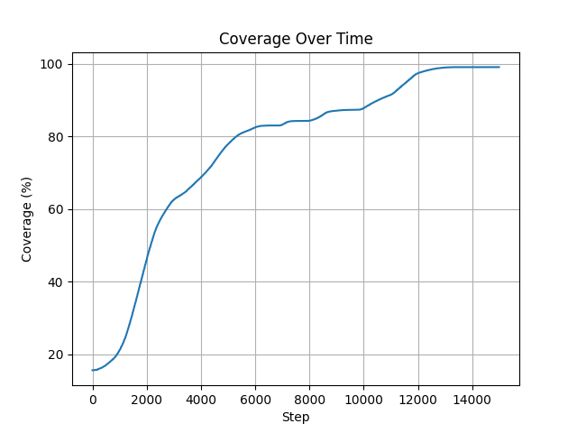

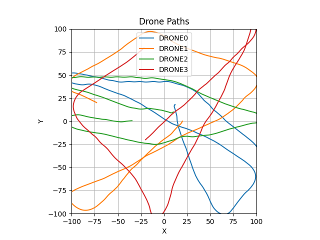

---

## v2
Travis - 04/12/26 (later in the night after v1)

Ok so I made some changes to make my code more like the paper, while still being able to function somewhat correctly, but the 
code still needs to be improved. At current setup, max time multiplier is ~2.6x, for the tiny 30m by 30m area, 100x100 grid, sensor range of 20 cells (so like 6m), with 87.34% coverage.

Right now (and in v1 if i forgot to mention), instead of doing the full area (700m by 700m), I am testing in a ~30m by 30m area, 
and the drones are only flying at a max speed of 1m/s (edit: paper also has max speed of 1m/s). This is because the drones have a tendency to lose control and crash if they are 
flying too fast or try to rapidly change directions due to pheromones, and I haven't been able to find a good way to fix that yet.

For the size of the area, this is because if I do too large of an area while keeping the grid size the same (100x100) then each grid becomes 
too large and the drones end up overcorrecting to reach new squares quickly and crashing. Thus as far as I can tell we would need
to increase the grid size (which is probably why the paper sometimes refers to the grid as 500x500), but when I do that it runs 
insanely slow and I haven't had time to look into optimizing it yet. So thats for later.

But it kinda does an okay job compared to what the paper showed. Obviously its a terrible pathing but it is able to roughly
stay in the correct area and with 4 drones and 15k time-steps it is able to do about 80% coverage... 

Although I will say, if you look at the paths the drones take, some seem to almost follow their exact same path twice, which is odd.
Although now that I mention it, I dont know if the paper actually says what the pheromone radius is (how big of an area is considered covered when a drone flies over it),
so maybe that is the issue and I just have it set too small.

Also if you plan to run the plot script, I have no clue why the other graphs it makes look scuffed. i think i messed up the 
data collection or something.

Here is the current coverage graph and drone flight path for the 4 drones with 15k time-steps and a 30m by 30m area.

The blue drone actually looks pretty good, doing roughly rows back and forth at ujniform distance for part of it, and then you
get others like red which does a lap around the area then starts going randomly...

Also, while the lines do go straight off, in the sim the drones do turn around very quickly after leaving the operating area.

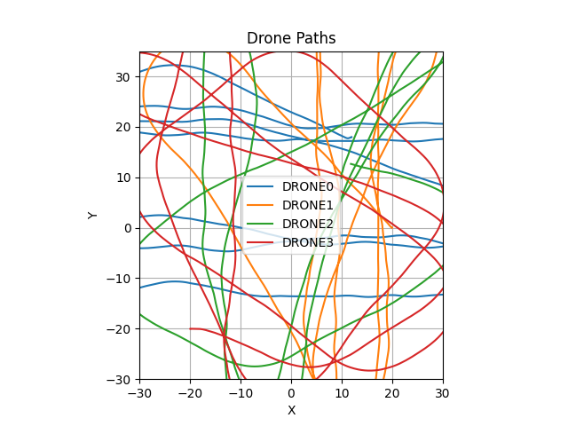

## v1
Travis - 04/12/26

Downloaded Webot and OSM area that the paper uses as their "map". Added 4 of the drones that the paper uses (Crazyflie quadcopters).
Tried making basic implementation to control them similar to AICA and was able to do it on a small scale (like a 30meter x 30meter area), 
and currently has performance issues if I try to scale it up (i already have some optimizations planned).

But the actual code is a kind of pain in the ass because you need to watch out for not telling the drones to move too far / too fast 
to avoid having them lose control and flip / crash. The drones came with a python file to do PID control on them, but still isn't perfect.

I tried to alter how my code works to follow the paper more accurately and the code actually performed worse, so for now this folder is the best i've done.

The python scripts can be found in `controllers/` with `iaca_drone/iaca_drone.py` to control individual drones and `iaca_supervisor/iaca_supervisor.py` the main supervisor script. 

I also generated a script to plot the results it finds.