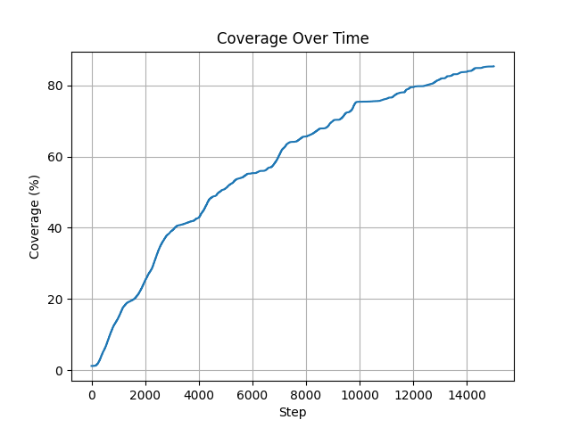

# Current WEBOT setup

## v2
Travis - 04/12/26 (later in the night after v1)

Ok so I made some changes to make my code more like the paper, while still being able to function somewhat correctly, but the 
code still needs to be improved. 

Right now (and in v1 if i forgot to mention), instead of doing the full area (700m by 700m), I am testing in a ~30m by 30m area, 
and the drones are only flying at a max speed of 1m/s. This is because the drones have a tendency to lose control and crash if they are 
flying too fast or try to rapidly change directions due to pheromones, and I haven't been able to find a good way to fix that yet.

For the size of the area, this is because if I do too large of an area while keeping the grid size the same (100x100) then each grid becomes 
too large and the drones end up overcorrecting to reach new squares quickly and crashing. Thus as far as I can tell we would need
to increase the grid size (which is probably why the paper sometimes refers to the grid as 500x500), but when I do that it runs 
insanely slow and I haven't had time to look into optimizing it yet. So thats for later.

But it kinda does an okay job compared to what the paper showed. Obviously its a terrible pathing but it is able to roughly
stay in the correct area and with 4 drones and 15k time-steps it is able to do about 80% coverage... 

Although I will say, if you look at the paths the drones take, some seem to almost follow their exact same path twice, which is odd.
Although now that I mention it, I dont know if the paper actually says what the pheromone radius is (how big of an area is considered covered when a drone flies over it),
so maybe that is the issue and I just have it set too small.

Also if you plan to run the plot script, I have no clue why the other graphs it makes look scuffed. i think i messed up the 
data collection or something.

Here is the current coverage graph and drone flight path for the 4 drones with 15k time-steps and a 30m by 30m area.

The blue drone actually looks pretty good, doing roughly rows back and forth at ujniform distance for part of it, and then you
get others like red which does a lap around the area then starts going randomly...

Also, while the lines do go straight off, in the sim the drones do turn around very quickly after leaving the operating area.

## v1
Travis - 04/12/26

Downloaded Webot and OSM area that the paper uses as their "map". Added 4 of the drones that the paper uses (Crazyflie quadcopters).
Tried making basic implementation to control them similar to AICA and was able to do it on a small scale (like a 30meter x 30meter area), 
and currently has performance issues if I try to scale it up (i already have some optimizations planned).

But the actual code is a kind of pain in the ass because you need to watch out for not telling the drones to move too far / too fast 
to avoid having them lose control and flip / crash. The drones came with a python file to do PID control on them, but still isn't perfect.

I tried to alter how my code works to follow the paper more accurately and the code actually performed worse, so for now this folder is the best i've done.

The python scripts can be found in `controllers/` with `iaca_drone/iaca_drone.py` to control individual drones and `iaca_supervisor/iaca_supervisor.py` the main supervisor script. 

I also generated a script to plot the results it finds.